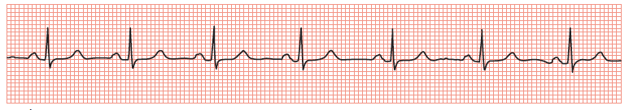
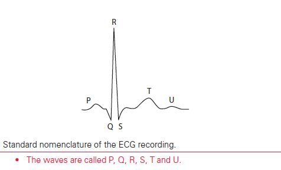
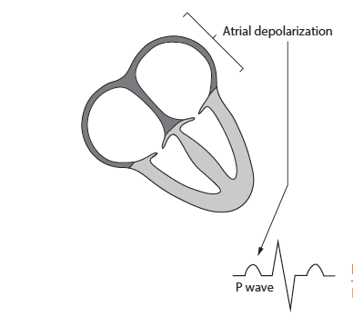
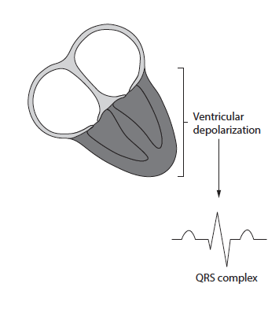

```{r setup, include=FALSE}
knitr::opts_chunk$set(echo = FALSE)
```


## Simulation of ECG

Simulation of ECG is a part of the large project of constructing dataset of data from health care analytics use cases. Reverse-engineering the published anonymized data about hospital readmission rates for diabetic patients, admission histories, fictitious personal details (names, birthdates, zip codes, weights) etc has already been generated. For variety of training and demonstrations this simulated data will be a great resource as there is no privacy concern related 



## The ECG project have several phases :
1) Simulate ECGs to match the pulse rates in the existing data.
2) Add changes in rhythm (without changing the average pulse rates.)
3) Engineer statistical features based on the rhythm differences.
4) Build an anomaly detector to watch for rhythm changes. 
5) Put together demos to showcase all of the above.

***

Current project is the first part of the the ECG project to simulate ECG rhythm matching with the pulse rate of the existing data set.

## Introduction to ECG data 
An electrocardiogram(ECG) is to measure how the electrical activity over time throughout the heart during each cardiac cycle. The contraction and relaxation can be measured by different components or waves, that represent the electrical activity in specific regions of the heart.

## The waves
The ECG cycle includes P waves, P-R segment and  interval, QRS complex, S-T segment and interval, Q-T interval, T wave. 



***
- P Wave – represents the movement of an electrical wave originating at the sinoatrial (SA) node and resulting in the depolarization of the left and right atria.
- P-R Interval – the time between the beginning of atrial depolarization and the beginning of ventricular depolarization. A change in P-R interval is often an indicator of the activity of the parasympathetic nervous system on the heart.
<div style= "width:200px; heigth= 100px">

</div>


***
- QRS Complex – represents the electrical activity from the beginning of the Q wave to the end of the S wave and the complete depolarization of the ventricles, leading to ventricular contraction and ejection of blood into the aorta and pulmonary arteries
- S-T Segment – the pause in electrical activity after the complete depolarization of the ventricles to allow blood to flow out of the ventricles before ventricular relaxation begins and the heart fills for the next contraction.
<div style= "width:200px; heigth= 50px">

</div>
***
- S-T Interval – the time between the end of ventricular depolarization (S wave) and the end of repolarization (T wave end).
- Q-T Interval – the time between the beginning of the ventricular depolarization (Q wave) and the end of repolarization (T wave end).
- T Wave – represents the repolarization of the ventricles.


***
__Fourier series__ were used for representing ECG signals, as any periodic functions which satisfy Dirichlet's condition can be expressed as a series of scaled magnitudes of sin and cos terms of frequencies which occur as a multiple of fundamental frequency.ECG signal is periodic with fundamental frequency determined by the heat beat Each significant feature of ECG signal can be represented by shifted and scaled versions of waveforms.

***
- To simulate chaotic heart rhythm __logistic map__ function was used.


- The logistic map is a polynomial mapping (equivalently, recurrence relation) of degree 2, often cited as an archetypal example of how complex, chaotic behaviour can arise from very simple non-linear dynamical equations.


## Simulating P wave
```{r, echo=TRUE}
p_wave <- function(x,c) {
    l=c# half heartbeat cycle.eg.s/heartbeat=1 cycle
    a=0.25#amplitude of p wave
    x=x+(l/1.8)# x is the wave starting point shifted.
    b=3# 2l/b is duration of p wave.
    n=100 # fourier series levels, the bigher the more accurate
    p1=0 # baseline
    p2=0 # p wave
    # fourier series to creat p wave
    for (i in 1:n){
      harm1<-(((sin((pi/(2*b))*(b-(2*i))))/(b- (2*i))+(sin((pi/(2*b))*(b+(2*i))))
               /(b+(2*i)))*(2/pi))*cos((i*pi*x)/l)
      p2<-p2+harm1
    }
    pwav1=p1+p2
    pwav=a*pwav1
    return(pwav)
}
x<-seq(0,5,0.001) 
pwav<-p_wave(x, 0.5)
plot(x=x, y=pwav, type='l', xlim=c(0,5), ylim=c(0, 1), xlab="ECG wave", ylab="MV",main="ECG p wave simulation")
```

## Simulating Q wave
```{r,echo= TRUE}
  q_wave<-function (x,c){
    l=c
    x=x+l/6
    a=0.03# amplitude 
    b=16#duration
    n=100
    q1=0 #(a/(2*b))*(2-b)
    q2=0
    for (i in 1:n){
      harm5=(((2*b*a)/(i*i*pi*pi))*(1-cos((i*pi)/b)))*cos((i*pi*x)/l);
      q2=q2+harm5}
    qwav=-1*(q1+q2)
    return (qwav)
  }
x<-seq(0,5,0.001) 
qwav<-q_wave(x, 0.5)
plot(x=x, y=qwav, type='l', xlim=c(0,5), ylim=c(0, 1), xlab="ECG wave", ylab="MV",main="ECG q wave simulation")
```

## Simulating QRS wave

```{r, echo= TRUE}
  qrs_wave<-function(x,c){
    l=c
    a=1
    b=5
    n=100
    qrs1=0 #(a/(2*b))*(2-b)
    qrs2=0
    for (i in 1:n){
      harm=(((2*b*a)/(i*i*pi*pi))*(1-cos((i*pi)/b)))*cos((i*pi*x)/l);
      qrs2=qrs2+harm}
    qrswav=qrs1+qrs2
    return(qrswav)
  }
x<-seq(0,5,0.001) 
qrswav<-qrs_wave(x, 0.5)
plot(x=x, y=qrswav, type='l', xlim=c(0,5), ylim=c(0, 1), xlab="ECG wave", ylab="MV",main="ECG qrs wave simulation")
```

## Simulating s wave
```{r, echo= TRUE}
  s_wave<-function(x,c){
    l=c
    x=x-l/6
    a=0.25
    b=15
    n=100;
    s1=0 # (a/(2*b))*(2-b);
    s2=0;
    for (i in 1:n){
      harm3=(((2*b*a)/(i*i*pi*pi))*(1-cos((i*pi)/b)))*cos((i*pi*x)/l);
      s2=s2+harm3}
    swav=-1*(s1+s2)
    return(swav)
  }
x<-seq(0,2,0.001) 
swav<-s_wave(x, 0.5)
plot(x=x, y=swav, type='l', xlim=c(0,5), ylim=c(-2, 1), xlab="ECG wave", ylab="MV",main="ECG s wave simulation")

```  


## Simulating t wave
```{r, echo= TRUE}

  t_wave<-function(x, c){
    l=c
    a=0.35
    x=x-l/1.8
    b=7
    n=100
    t1=0 # 1/l
    t2=0
    for (i in 1:n){
      harm2 = (((sin((pi/(2*b))*(b-(2*i))))/(b-(2*i))+(sin((pi/(2*b))*(b+(2*i))))/(b+(2*i)))*(2/pi))*cos((i*pi*x)/l);             
      t2 = t2+harm2
    }
    twav1 = t1+t2
    twav = a*twav1
    return (twav)
  }
x<-seq(0,2,0.001) 
twav<-t_wave(x, 0.5)
plot(x=x, y=twav, type='l', xlim=c(0,5), ylim=c(0, 1), xlab="ECG wave", ylab="MV",main="ECG t wave simulation")
```


***
 Finally a shiny app was bulit to show the simulation of the ECG wave and different sliders were added so that the user can control rate and  rhythm of the ECG


## Interactive Plot

```{r eruptions}
library(shiny)

ecg_wave <- function(x, c){
  
  p_wave <- function(x,c) {
    l=c# half heartbeat cycle.eg.s/heartbeat=1 cycle
    a=0.25#amplitude of p wave
    x=x+(l/1.8)# x is the wave starting point shifted.
    b=3# 2l/b is duration of p wave.
    n=100 # fourier series levels, the bigher the more accurate
    p1=0 # baseline
    p2=0 # p wave
    # fourier series to creat p wave
    for (i in 1:n){
      harm1<-(((sin((pi/(2*b))*(b-(2*i))))/(b- (2*i))+(sin((pi/(2*b))*(b+(2*i))))
               /(b+(2*i)))*(2/pi))*cos((i*pi*x)/l)
      p2<-p2+harm1
    }
    pwav1=p1+p2
    pwav=a*pwav1
    return(pwav)
  }
  
  ####### q wave
  q_wave<-function (x,c){
    l=c
    x=x+l/6
    a=0.03# amplitude 
    b=16#duration
    n=100
    q1=0 #(a/(2*b))*(2-b)
    q2=0
    for (i in 1:n){
      harm5=(((2*b*a)/(i*i*pi*pi))*(1-cos((i*pi)/b)))*cos((i*pi*x)/l);
      q2=q2+harm5}
    qwav=-1*(q1+q2)
    return (qwav)
  }
  
  
  #### qrs wave
  qrs_wave<-function(x,c){
    l=c
    a=1
    b=5
    n=100
    qrs1=0 #(a/(2*b))*(2-b)
    qrs2=0
    for (i in 1:n){
      harm=(((2*b*a)/(i*i*pi*pi))*(1-cos((i*pi)/b)))*cos((i*pi*x)/l);
      qrs2=qrs2+harm}
    qrswav=qrs1+qrs2
    return(qrswav)
  }
  
  ##### s wave
  s_wave<-function(x,c){
    l=c
    x=x-l/6
    a=0.25
    b=15
    n=100;
    s1=0 # (a/(2*b))*(2-b);
    s2=0;
    for (i in 1:n){
      harm3=(((2*b*a)/(i*i*pi*pi))*(1-cos((i*pi)/b)))*cos((i*pi*x)/l);
      s2=s2+harm3}
    swav=-1*(s1+s2)
    return(swav)
  }
  
  
  ##### t wave
  t_wave<-function(x, c){
    l=c
    a=0.35
    x=x-l/1.8
    b=7
    n=100
    t1=0 # 1/l
    t2=0
    for (i in 1:n){
      harm2 = (((sin((pi/(2*b))*(b-(2*i))))/(b-(2*i))+(sin((pi/(2*b))*(b+(2*i))))/(b+(2*i)))*(2/pi))*cos((i*pi*x)/l);             
      t2 = t2+harm2
    }
    twav1 = t1+t2
    twav = a*twav1
    return (twav)
  }
  
  p_wave(x, c) + qrs_wave(x, c) + t_wave(x, c) + s_wave(x, c) + q_wave(x, c)
}


fit_ecg_waves_to_beats <- function(Q, sampling_rate=125){
  
  PP <- diff(c(0, Q))  # re-create P as "PP": might just want to use P

  x <- seq(0, sum(PP), by=1/sampling_rate)
  x_start = 0
  
  ecg <- numeric(length(x))
  
  for (i in 1:length(PP)) {
    x_end = x_start + PP[i]
    if (i == length(PP)) {
      x_used = subset(x, x>=x_start)
    } else {
      x_used = subset(x, x>=x_start & x<x_end)
    }

    next_wave <- ecg_wave(x_used - x_start, PP[i]/2)
    
    # ecg <- c(ecg, next_wave)
    ecg[x %in% x_used] <- next_wave

    x_start <- x_end
  }
  
  return(ecg)
}


ui <- fluidPage(
  inputPanel(
    selectInput("T", label = "total heart beats:",
                choices = c(5, 10, 20, 30, 45, 60, 100), selected = 20),

    selectInput("P1", label = "starting value:",
                choices = c(0.00001, 0.1, 0.2, 0.3, 0.4, 0.5, 0.6, 0.7, 0.8, 0.9, 0.99999), selected = 0.50),
    
    sliderInput("r", label = "r:",
                min = 2.00, max = 3.99, value = 3.0, step = 0.01),
    
    sliderInput("cons", label = "constant:",
                min = 0, max = 1, value = 0.0, step = 0.001)
  ),
  
  mainPanel(
    plotOutput(outputId ="plot")
  )
  
)

server <- function(input, output){
  output$plot <- renderPlot({
    T <- as.numeric(input$T)
    
    P <- numeric(T)
    
    P[1] <- as.numeric(input$P1)
    r <- as.numeric(input$r)
    
    display_start <- 1 #as.numeric(input$display_start)
   
    for (i in 2:T) P[i] <- r * P[i - 1] * (1 - P[i - 1])
    P <- P + as.numeric(input$cons)
    
    SAMPLING_RATE <- 125
    Q <- cumsum(P[display_start:length(P)])
    ecg <- fit_ecg_waves_to_beats(Q, sampling_rate=SAMPLING_RATE)
    t <- seq_along(ecg)/SAMPLING_RATE
    
    op <- par(no.readonly = TRUE, mfrow=c(3,1))
    
    plot(P[display_start:length(P)], 
         type='l', ylim=c(0, 1), ylab="interval",
         main=sprintf("r = %0.2f", r))
    
    plot(t, ecg, xlab = 'x',ylab='Mv', 
         type='l', main='ECG wave')
    abline(v=c(0, Q), lty=3, col="red")
    
    par(op)
  }, height = 500, width = 600)
  
}


shinyApp(ui=ui, server=server)


```


## Next stps
- Fit to 15 seconds of a target heart rate (fractional value, e.g, 62.52 bpm).
- Put a series of 15-second segments together.
- Add option for data-driven curve shape.
- Return a JSON file.
- Optimize performance.

